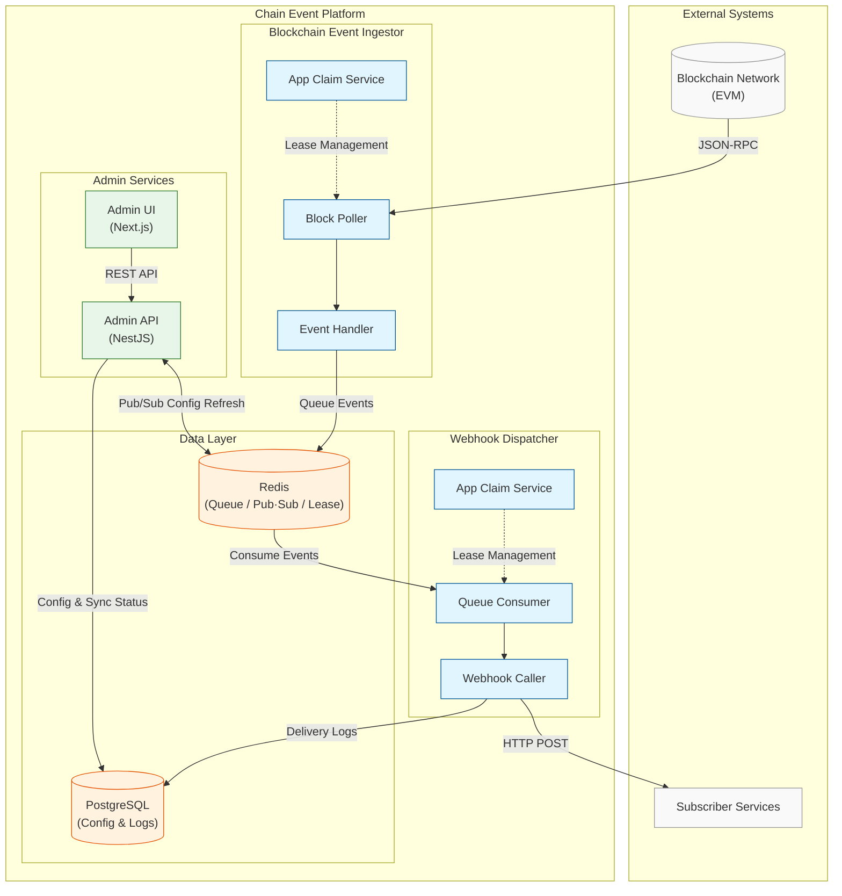
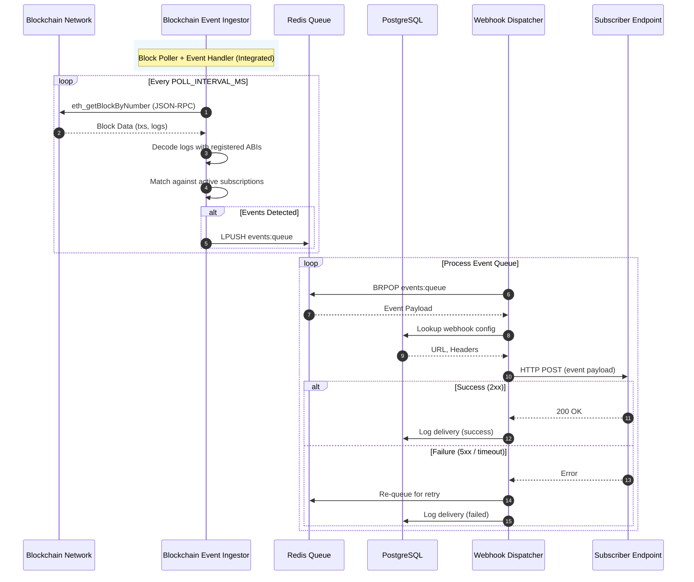
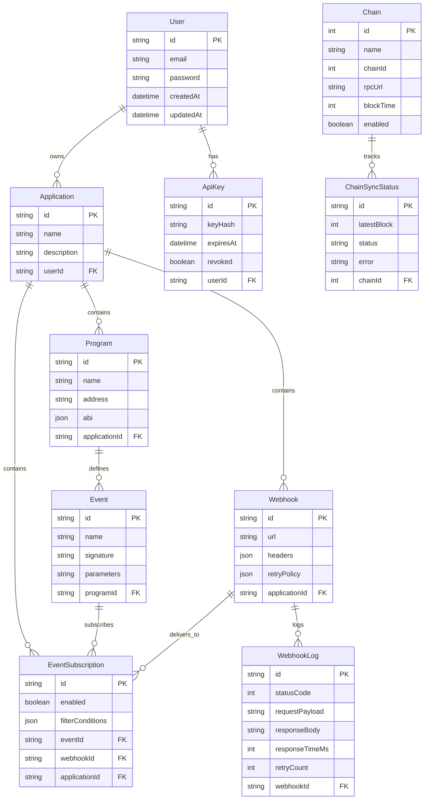

# Chain Event Platform

A centralized blockchain event aggregation and dispatch platform that eliminates redundant blockchain tracking across services.

Document(detail) : [deepwiki](https://deepwiki.com/ymseok/chain-event-platform)

## Overview

Chain Event Platform acts as middleware that monitors blockchain networks and dispatches relevant events to subscriber services. Instead of each service independently tracking blockchain blocks, this platform provides a unified solution for event detection and delivery.

### Key Features

- **Centralized Block Tracking**: Single engine monitors blockchain to prevent redundant node queries
- **Event Subscription**: Services register specific smart contract events to monitor
- **Webhook Dispatch**: Automatic event delivery via registered webhooks with retry logic
- **Multi-Chain Support**: Designed to support multiple EVM-compatible networks
- **Horizontal Scaling**: Claim-based partitioning allows multiple ingestor/dispatcher instances
- **Real-Time Dashboard**: Monitor applications, events, webhooks, and system health
- **API Key Authentication**: Secure webhook delivery with hashed API keys

## Architecture



### Data Flow



### Components

| Package | Description | Port |
|---------|-------------|------|
| `admin-api` | REST API for managing applications, programs, webhooks, subscriptions, and chains | 3001 |
| `admin-ui` | Dashboard for monitoring, configuration, and analytics | 3002 |
| `blockchain-event-ingestor` | Reads blocks from blockchain nodes, detects events, and queues them | - |
| `webhook-dispatcher` | Consumes event queue and delivers to registered webhook endpoints | - |
| `demo-contract` | Sample ERC20 token contract for testing (Foundry) | - |
| `demo-webhook` | Demo webhook receiver for testing event delivery | 3003 |

> Note: Block polling and event detection are integrated within `blockchain-event-ingestor`.

## Tech Stack

- **Backend**: TypeScript, NestJS, Prisma ORM, ethers.js
- **Frontend**: TypeScript, Next.js 14, Tailwind CSS, shadcn/ui, React Query, Recharts
- **Database**: PostgreSQL 16
- **Message Queue**: Redis 7 (Queue, Pub/Sub, Distributed Leasing)
- **Smart Contracts**: Solidity, Foundry (Forge, Anvil, Cast)
- **Containerization**: Docker, Docker Compose

## Prerequisites

- Node.js >= 20.0.0
- pnpm >= 8.0.0
- Docker & Docker Compose
- [Foundry](https://book.getfoundry.sh/getting-started/installation) (for local blockchain testing)

## Getting Started

### 1. Clone the Repository

```bash
git clone https://github.com/ymseok/chain-event-platform.git
cd chain-event-platform
```

### 2. Install Dependencies

```bash
pnpm install
```

### 3. Configure Environment

```bash
# Copy environment templates
cp packages/admin-api/.env.example packages/admin-api/.env
cp packages/blockchain-event-ingestor/.env.example packages/blockchain-event-ingestor/.env
cp packages/webhook-dispatcher/.env.example packages/webhook-dispatcher/.env

# Edit configuration as needed
```

### 4. Start Infrastructure Services

Start PostgreSQL and Redis using Docker Compose:

```bash
pnpm docker:up
```

Verify containers are running:

```bash
docker ps
# Should show postgres (5432) and redis (6379) containers
```

### 5. Initialize Database

```bash
# Generate Prisma client
pnpm prisma:generate

# Run database migrations
pnpm prisma:migrate
```

### 6. Start All Services (Development)

```bash
# Start all services concurrently
pnpm dev:all

# Or start individually in separate terminals:
pnpm dev:admin-api               # Terminal 1
pnpm dev:admin-ui                # Terminal 2
pnpm dev:blockchain-event-ingestor  # Terminal 3
pnpm dev:webhook-dispatcher      # Terminal 4
```

## Horizontal Scaling

The platform supports multi-instance horizontal scaling for both the **Ingestor** and **Webhook Dispatcher** via claim-based partitioning.

Both services share the same architectural design — each contains an `AppClaimService` that uses Redis distributed leases to partition applications across instances. This symmetrical architecture ensures that the Ingestor and Dispatcher scale independently using an identical partitioning mechanism.

### How It Works

1. Each instance registers with a unique `instanceId`
2. Instances use Redis distributed leases to claim applications
3. Each application is processed by exactly one instance at a time
4. When an instance leaves, its leases expire and other instances automatically claim the released applications

```
┌─────────────────┐   ┌─────────────────┐   ┌─────────────────┐
│  Ingestor #1    │   │  Ingestor #2    │   │  Ingestor #3    │
│  (App A, App B) │   │  (App C, App D) │   │  (App E)        │
└────────┬────────┘   └────────┬────────┘   └────────┬────────┘
         │                     │                     │
         └─────────────┬───────┘─────────────────────┘
                       ▼
              ┌─────────────────┐
              │     Redis       │
              │  (Lease Store)  │
              └─────────────────┘
```

### Configuration

Partitioning is configured via environment variables in each service:

| Variable | Description | Default |
|----------|-------------|---------|
| `PARTITIONING_ENABLED` | Enable/disable partitioning | `false` |
| `PARTITIONING_LEASE_TTL_SEC` | Lease time-to-live in seconds | `30` |
| `PARTITIONING_CLAIM_INTERVAL_MS` | How often to claim/renew leases | `10000` |
| `PARTITIONING_INSTANCE_ID` | Unique instance identifier | auto-generated |

## Local Development Testing Guide

This section provides a step-by-step guide for testing the complete event pipeline locally.

### Prerequisites for Testing

Ensure you have:
- Docker running (for PostgreSQL and Redis)
- Foundry installed (`foundryup` to install/update)
- All dependencies installed (`pnpm install`)

### Step 1: Start Infrastructure Services

```bash
# Start PostgreSQL and Redis containers
pnpm docker:up

# Verify containers are running
docker ps
# Expected: postgres (5432), redis (6379)
```

### Step 2: Initialize Database Schema

```bash
# Generate Prisma client and run migrations
pnpm prisma:generate
pnpm prisma:migrate

# (Optional) Verify database with Prisma Studio
pnpm prisma:studio
# Opens browser at http://localhost:5555
```

### Step 3: Start Admin API

```bash
# Terminal 1: Start Admin API server
pnpm dev:admin-api

# Wait for message: "Application is running on: http://localhost:3001"
# API docs available at: http://localhost:3001/api/docs
```

### Step 4: Start Admin UI

```bash
# Terminal 2: Start Admin UI
pnpm dev:admin-ui

# Access at: http://localhost:3002
```

### Step 5: Start Demo Webhook Server

```bash
# Terminal 3: Start demo webhook receiver
pnpm dev:demo-webhook

# Access at: http://localhost:3003
# Generate an API Key from the dashboard (save it for later)
```

### Step 6: Start Local Blockchain (Anvil)

```bash
# Terminal 4: Start Anvil local blockchain
cd packages/demo-contract
pnpm anvil

# Anvil starts with:
# - RPC URL: http://127.0.0.1:8545
# - Chain ID: 31337
# - Pre-funded test accounts (10,000 ETH each)
```

### Step 7: Deploy SampleToken Contract

```bash
# Terminal 5: Deploy the test ERC20 contract
cd packages/demo-contract
pnpm deploy:local

# Expected output shows deployed contract address:
# "SampleToken deployed at: 0x5FbDB2315678afecb367f032d93F642f64180aa3"
```

### Step 8: Configure via Admin UI

Open http://localhost:3002 in your browser and perform the following:

#### 8.1 Create Application
1. Navigate to **Applications** menu
2. Click **Create Application**
3. Fill in application name and description
4. Save the created application

#### 8.2 Register Program (Smart Contract ABI)
1. Navigate to the application detail page
2. Go to **Programs** tab
3. Click **Register Program**
4. Enter contract address: `0x5FbDB2315678afecb367f032d93F642f64180aa3`
5. Upload ABI file: `packages/demo-contract/out/SampleToken.sol/SampleToken.json`

#### 8.3 Register Webhook
1. Navigate to the application detail page
2. Go to **Webhooks** tab
3. Click **Create Webhook**
4. Enter webhook URL: `http://localhost:3003/api/webhook`
5. Add header: `x-api-key` with the API key from Step 5
6. Save the webhook configuration

#### 8.4 Create Subscription
1. Navigate to the application detail page
2. Go to **Subscriptions** tab
3. Click **Create Subscription**
4. Select the registered program
5. Select event types (e.g., `Transfer`, `Approval` - multiple selection supported)
6. Select the webhook to receive events
7. Activate the subscription

#### 8.5 Configure Chain (if needed)
1. Navigate to **Settings > Chains**
2. Add or verify the local chain:
   - Chain ID: `31337`
   - RPC URL: `http://127.0.0.1:8545`
   - Block Time: `1`

### Step 9: Start Event Processing Services

```bash
# Terminal 6: Start Blockchain Event Ingestor
pnpm dev:blockchain-event-ingestor

# Terminal 7: Start Webhook Dispatcher
pnpm dev:webhook-dispatcher
```

### Step 10: Generate Test Events

Execute test scripts to generate blockchain events:

```bash
cd packages/demo-contract/ext_script

# Test Transfer event
./transfer.sh
# Transfers 1 token from account[0] to account[1]

# Test Approval event
./approve.sh
# Approves account[1] to spend tokens on behalf of account[0]
```

### Step 11: Verify Event Delivery

1. Open **Demo Webhook** dashboard: http://localhost:3003
2. Check the **Event Log** for incoming webhook requests
3. Verify:
   - Event type matches (Transfer/Approval)
   - Payload contains correct event data
   - Timestamp is recent

### Troubleshooting

| Issue | Solution |
|-------|----------|
| Database connection error | Verify PostgreSQL is running: `docker ps` |
| Redis connection error | Verify Redis is running: `docker ps` |
| Contract deployment fails | Ensure Anvil is running on port 8545 |
| No events received | Check subscription is active in Admin UI |
| Webhook delivery fails | Verify demo-webhook is running and API key is correct |
| Ingestor not processing | Check chain configuration in Settings > Chains |

## Available Scripts

| Command | Description |
|---------|-------------|
| `pnpm docker:up` | Start PostgreSQL and Redis containers |
| `pnpm docker:down` | Stop infrastructure containers |
| `pnpm docker:logs` | View container logs |
| `pnpm dev:all` | Start all services concurrently |
| `pnpm dev:admin-api` | Start Admin API in development mode |
| `pnpm dev:admin-ui` | Start Admin UI in development mode |
| `pnpm dev:demo-webhook` | Start Demo Webhook server |
| `pnpm dev:blockchain-event-ingestor` | Start Block Ingestor |
| `pnpm dev:webhook-dispatcher` | Start Webhook Dispatcher |
| `pnpm build` | Build all packages |
| `pnpm build:admin-api` | Build Admin API |
| `pnpm build:admin-ui` | Build Admin UI |
| `pnpm build:blockchain-event-ingestor` | Build Ingestor |
| `pnpm build:webhook-dispatcher` | Build Dispatcher |
| `pnpm test` | Run tests across all packages |
| `pnpm lint` | Lint all packages |
| `pnpm format` | Format code with Prettier |
| `pnpm prisma:generate` | Generate Prisma client |
| `pnpm prisma:migrate` | Run database migrations |
| `pnpm prisma:studio` | Open Prisma Studio |

## Environment Variables

### Admin API

| Variable | Description | Default |
|----------|-------------|---------|
| `NODE_ENV` | Environment mode | `development` |
| `PORT` | Server port | `3001` |
| `API_PREFIX` | API route prefix | `api/v1` |
| `CORS_ORIGIN` | Allowed CORS origins | `*` |
| `DATABASE_URL` | PostgreSQL connection string | - |
| `REDIS_HOST` | Redis host | `localhost` |
| `REDIS_PORT` | Redis port | `6379` |
| `JWT_SECRET` | JWT signing secret | - |
| `JWT_EXPIRES_IN` | Access token expiration | `15m` |
| `JWT_REFRESH_SECRET` | Refresh token secret | - |
| `JWT_REFRESH_EXPIRES_IN` | Refresh token expiration | `7d` |
| `API_KEY_SALT` | Salt for API key hashing | - |
| `WEBHOOK_TEST_TIMEOUT_MS` | Webhook test timeout | `5000` |
| `RATE_LIMIT_TTL` | Rate limit window (seconds) | `60` |
| `RATE_LIMIT_MAX` | Max requests per window | `100` |

### Blockchain Event Ingestor

| Variable | Description | Default |
|----------|-------------|---------|
| `ADMIN_API_URL` | Admin API URL for configuration | `http://localhost:3001/api/v1` |
| `REDIS_HOST` | Redis host | `localhost` |
| `REDIS_PORT` | Redis port | `6379` |
| `POLL_INTERVAL_MS` | Block polling interval | `1000` |
| `STATUS_REPORT_INTERVAL_MS` | Status report interval | `30000` |
| `LOG_LEVEL` | Logging level | `info` |

### Webhook Dispatcher

| Variable | Description | Default |
|----------|-------------|---------|
| `NODE_ENV` | Environment mode | `development` |
| `DATABASE_URL` | PostgreSQL connection string | - |
| `REDIS_HOST` | Redis host | `localhost` |
| `REDIS_PORT` | Redis port | `6379` |
| `WEBHOOK_TIMEOUT_MS` | Webhook HTTP request timeout | `10000` |
| `CONCURRENCY_PER_APP` | Concurrent webhook calls per app | `5` |
| `BRPOP_TIMEOUT_SEC` | Redis blocking pop timeout | `5` |

### Admin UI

| Variable | Description | Default |
|----------|-------------|---------|
| `NEXT_PUBLIC_API_URL` | Admin API URL | `http://localhost:3001/api/v1` |

## Project Structure

```
chain-event-platform/
├── packages/
│   ├── admin-api/                    # NestJS Backend API
│   │   ├── src/
│   │   │   ├── modules/
│   │   │   │   ├── api-keys/         # API key management (CRUD, pagination, revocation)
│   │   │   │   ├── applications/     # Application management
│   │   │   │   ├── auth/             # JWT authentication & refresh tokens
│   │   │   │   ├── chains/           # Blockchain chain management
│   │   │   │   ├── chain-sync-status/# Chain synchronization tracking
│   │   │   │   ├── dashboard/        # Dashboard statistics & analytics
│   │   │   │   ├── dispatcher/       # Dispatcher instance management (partitioning)
│   │   │   │   ├── events/           # Smart contract event definitions
│   │   │   │   ├── health/           # Health check endpoint
│   │   │   │   ├── ingestor/         # Ingestor instance management (partitioning)
│   │   │   │   ├── programs/         # Smart contract program registry
│   │   │   │   ├── statistics/       # Real-time statistics
│   │   │   │   ├── subscriptions/    # Event subscriptions
│   │   │   │   ├── users/            # User management
│   │   │   │   ├── webhook-logs/     # Webhook execution logs
│   │   │   │   └── webhooks/         # Webhook configuration & testing
│   │   │   ├── common/              # Decorators, guards, filters, utils
│   │   │   ├── database/            # Prisma configuration
│   │   │   └── redis/               # Redis publisher service
│   │   ├── prisma/                  # Database schema & migrations
│   │   └── docker-compose.yml       # PostgreSQL + Redis
│   │
│   ├── admin-ui/                    # Next.js Dashboard
│   │   └── src/app/
│   │       ├── (auth)/              # Login / Register pages
│   │       └── (dashboard)/
│   │           ├── dashboard/       # Analytics overview
│   │           ├── applications/    # Application management
│   │           │   └── [id]/
│   │           │       ├── programs/       # Contract registration
│   │           │       ├── webhooks/       # Webhook management
│   │           │       ├── subscriptions/  # Event subscriptions
│   │           │       └── settings/       # API key management
│   │           ├── webhooks/[id]/   # Webhook detail & logs
│   │           ├── programs/[id]/   # Program detail
│   │           ├── subscriptions/[id]/ # Subscription detail
│   │           └── settings/
│   │               ├── chains/      # Chain management
│   │               ├── ingestors/   # Ingestor instance monitoring
│   │               └── dispatchers/ # Dispatcher instance monitoring
│   │
│   ├── blockchain-event-ingestor/   # Block Reader Service
│   │   └── src/
│   │       ├── services/
│   │       │   ├── admin-api.service.ts     # Admin API communication
│   │       │   ├── app-claim.service.ts     # Claim-based partitioning
│   │       │   ├── app-progress.service.ts  # Block progress tracking
│   │       │   ├── block-poller.service.ts  # Block polling & event detection
│   │       │   ├── chain-manager.service.ts # Chain synchronization
│   │       │   ├── config-subscriber.service.ts # Config refresh via Pub/Sub
│   │       │   └── queue-publisher.service.ts   # Redis queue publishing
│   │       └── config/              # Configuration
│   │
│   ├── webhook-dispatcher/          # Webhook Delivery Service
│   │   └── src/
│   │       ├── modules/dispatcher/
│   │       │   ├── app-claim.service.ts        # Claim-based partitioning
│   │       │   ├── dispatcher.service.ts       # Main dispatch orchestration
│   │       │   ├── queue-consumer.service.ts   # Redis queue consumption
│   │       │   ├── webhook-caller.service.ts   # HTTP webhook calls
│   │       │   └── webhook-log.repository.ts   # Delivery logging
│   │       └── common/              # Constants & config
│   │
│   ├── demo-contract/               # Foundry Smart Contracts
│   │   ├── src/                     # SampleToken.sol, Counter.sol
│   │   ├── script/                  # Deployment scripts
│   │   ├── test/                    # Contract tests
│   │   └── ext_script/              # External test scripts (transfer.sh, approve.sh)
│   │
│   └── demo-webhook/                # Webhook Receiver for Testing
│       └── src/app/
│           ├── api/                 # Webhook receiver endpoints
│           └── settings/            # API key management UI
│
├── spec/                            # Specifications
├── CLAUDE.md                        # Project instructions
└── package.json                     # Workspace root
```

## Database Schema



## API Documentation

Once the Admin API is running, access the Swagger documentation at:

```
http://localhost:3001/api/docs
```

### Key API Endpoints

| Method | Endpoint | Description |
|--------|----------|-------------|
| POST | `/api/v1/auth/register` | Register a new user |
| POST | `/api/v1/auth/login` | Login and get JWT tokens |
| POST | `/api/v1/auth/refresh` | Refresh access token |
| GET | `/api/v1/applications` | List user applications |
| POST | `/api/v1/applications` | Create application |
| GET | `/api/v1/programs` | List programs |
| POST | `/api/v1/programs` | Register a smart contract program |
| GET | `/api/v1/webhooks` | List webhooks |
| POST | `/api/v1/webhooks` | Create webhook |
| POST | `/api/v1/webhooks/:id/test` | Test webhook connectivity |
| GET | `/api/v1/subscriptions` | List event subscriptions |
| POST | `/api/v1/subscriptions` | Create subscription |
| PATCH | `/api/v1/subscriptions/:id/toggle` | Toggle subscription status |
| GET | `/api/v1/chains` | List blockchain chains |
| POST | `/api/v1/chains` | Add a new chain |
| GET | `/api/v1/dashboard/stats` | Get dashboard statistics |
| GET | `/api/v1/api-keys` | List API keys (paginated) |
| POST | `/api/v1/api-keys` | Create API key |
| DELETE | `/api/v1/api-keys/:id` | Revoke API key |
| GET | `/api/v1/ingestors` | List ingestor instances |
| GET | `/api/v1/dispatchers` | List dispatcher instances |

## Contributing

1. Create a feature branch from `main`
2. Make your changes following the coding standards
3. Write tests for new functionality
4. Run `pnpm build` to verify no compilation errors
5. Submit a pull request

## License

MIT License - see [LICENSE](LICENSE) for details.
